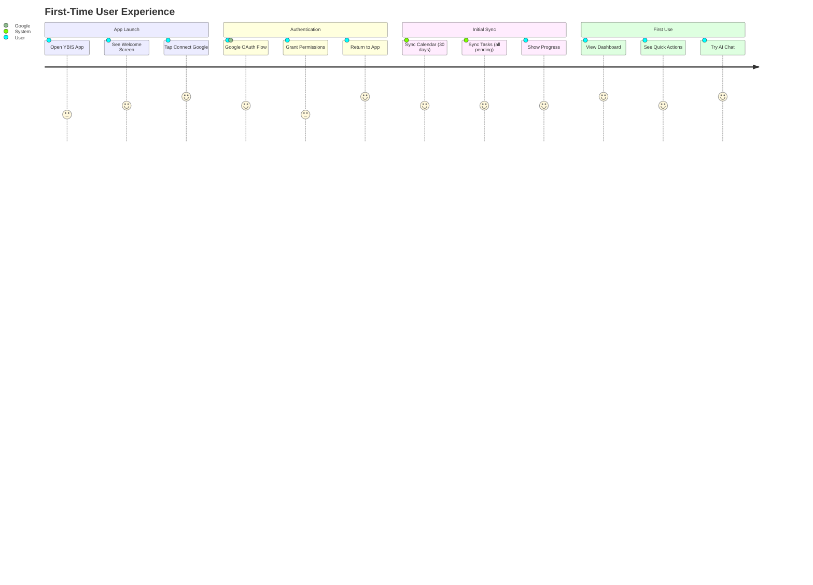
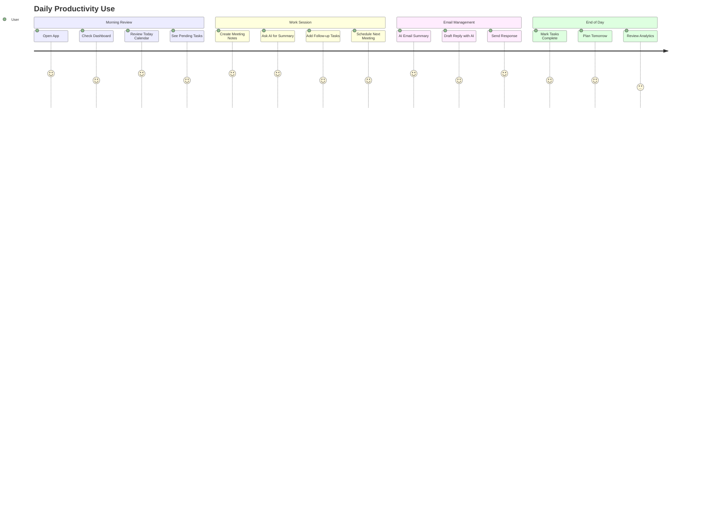
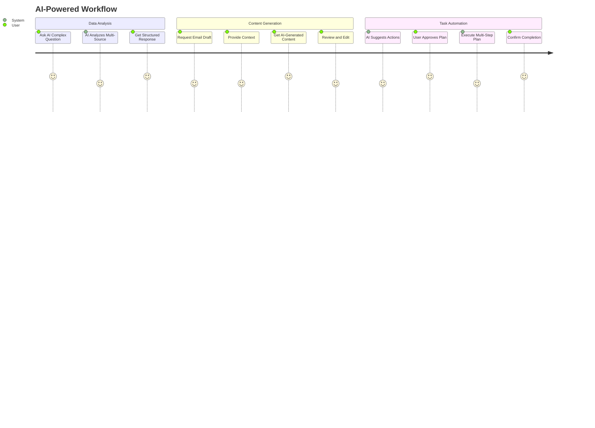
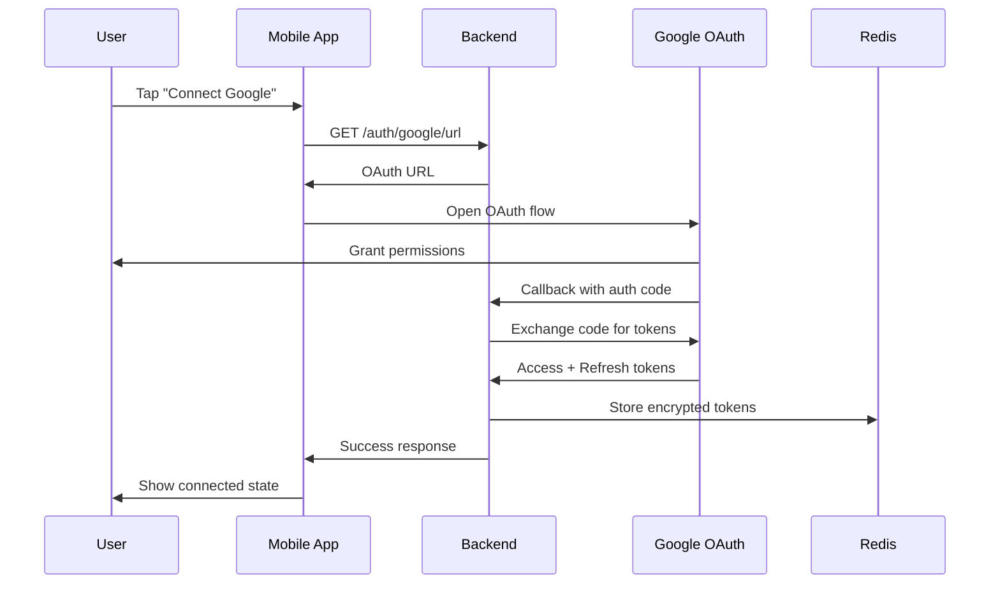
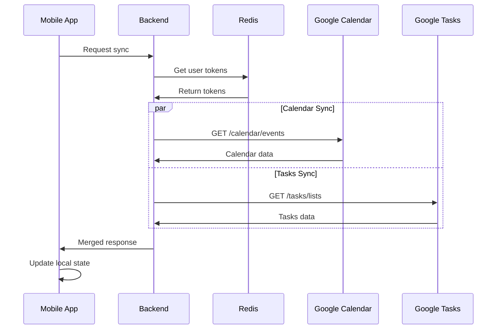
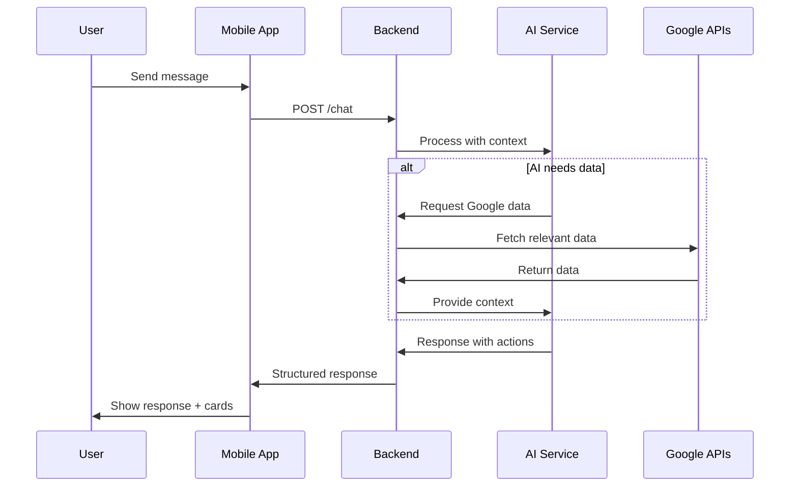
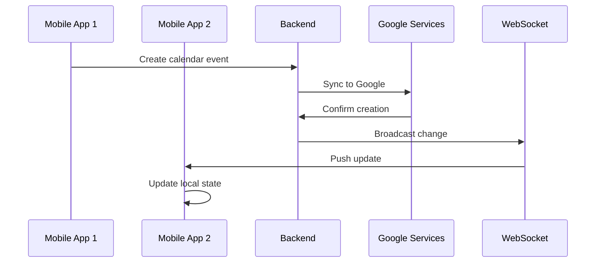

# YBIS Full Application Blueprint

**Date:** 2025-09-20
**Version:** Complete System Design
**Status:** Comprehensive Blueprint

---

## 📋 **Table of Contents**
1. [System Overview](#system-overview)
2. [User Journey Maps](#user-journey-maps)
3. [Data Flow Diagrams](#data-flow-diagrams)
4. [Complete Feature Matrix](#complete-feature-matrix)
5. [API Contract Specifications](#api-contract-specifications)
6. [Mobile Screen Architecture](#mobile-screen-architecture)
7. [State Management Strategy](#state-management-strategy)
8. [Sync & Conflict Resolution](#sync--conflict-resolution)
9. [Security & Privacy](#security--privacy)
10. [Performance & Scalability](#performance--scalability)
11. [Error Handling & Recovery](#error-handling--recovery)
12. [Testing Strategy](#testing-strategy)

---

## 🎯 **System Overview**

### **Mission Statement**
YBIS is an AI-powered business intelligence platform that unifies Google Workspace data with intelligent analysis, task management, and cross-platform accessibility.

### **Core Value Propositions**
1. **Unified Data Access:** Single interface for Gmail, Calendar, Tasks, and Notes
2. **AI-Powered Insights:** Intelligent analysis and automation
3. **Cross-Platform Sync:** Real-time synchronization across devices
4. **Business Intelligence:** Analytics and productivity metrics
5. **Extensible Architecture:** Plugin-based tool system

### **Target Users**
- **Primary:** Knowledge workers using Google Workspace
- **Secondary:** Small business owners and entrepreneurs
- **Tertiary:** Teams needing collaborative intelligence tools

---

## 🗺️ **User Journey Maps**

### **Journey 1: First-Time User Onboarding**


### **Journey 2: Daily Productivity Workflow**


### **Journey 3: Advanced AI Interaction**


---

## 🔄 **Data Flow Diagrams**

### **Authentication Flow**


### **Google Sync Flow**


### **AI Chat Flow**


### **Real-time Sync Flow**


---

## 📊 **Complete Feature Matrix**

### **Core Features**

| Feature | Backend Status | Mobile Status | Sync Status | Priority |
|---------|---------------|---------------|-------------|----------|
| **Authentication** |
| Google OAuth | ✅ Complete | ❌ Missing | N/A | P0 |
| Token Management | ✅ Complete | ❌ Missing | N/A | P0 |
| **Google Calendar** |
| List Events | ✅ Complete | ❌ Missing | ❌ Manual | P0 |
| Create Event | ✅ Complete | ❌ Missing | ❌ Manual | P0 |
| Update Event | ✅ Complete | ❌ Missing | ❌ Manual | P0 |
| Delete Event | ✅ Complete | ❌ Missing | ❌ Manual | P0 |
| **Google Tasks** |
| List Tasks | 🔄 Mock Only | ❌ Missing | ❌ Missing | P0 |
| Create Task | 🔄 Mock Only | ❌ Missing | ❌ Missing | P0 |
| Update Task | 🔄 Mock Only | ❌ Missing | ❌ Missing | P0 |
| Complete Task | 🔄 Mock Only | ❌ Missing | ❌ Missing | P0 |
| **Gmail** |
| Read Emails | ✅ Complete | ❌ Missing | ❌ Manual | P1 |
| Send Email | ✅ Complete | ❌ Missing | ❌ Manual | P1 |
| Search Emails | ✅ Complete | ❌ Missing | ❌ Manual | P1 |
| **AI Chat** |
| Send Message | ✅ Complete | ✅ Complete | N/A | P0 |
| Tool Integration | ✅ Complete | ❌ Partial | N/A | P0 |
| **Notes** |
| CRUD Operations | ✅ Complete | ✅ Complete | ❌ Missing | P1 |
| Search Notes | ✅ Complete | ❌ Missing | ❌ Missing | P1 |
| **Analytics** |
| Text Analysis | ✅ Complete | ❌ Missing | N/A | P2 |
| Usage Metrics | ❌ Missing | ❌ Missing | N/A | P2 |

### **Advanced Features (Future)**

| Feature | Description | Priority | Dependencies |
|---------|-------------|----------|--------------|
| **Real-time Sync** | Live updates across devices | P0 | WebSocket, Conflict Resolution |
| **Offline Support** | Work without internet | P1 | Local DB, Sync Queue |
| **Voice Commands** | Voice-to-text + AI | P2 | Speech API, Voice Processing |
| **OCR Integration** | Image text extraction | P2 | OCR Service, Image Upload |
| **Team Collaboration** | Shared workspaces | P3 | Multi-tenant, Permissions |
| **Advanced Analytics** | Business intelligence | P2 | Data Pipeline, Visualization |

---

## 📱 **Mobile Screen Architecture**

### **Complete Screen Map**
```
App Navigator
├── Authentication Flow
│   ├── WelcomeScreen
│   ├── GoogleAuthScreen
│   └── PermissionsScreen
│
├── Main Tab Navigator
│   ├── Dashboard Tab
│   │   ├── DashboardScreen ✅
│   │   ├── MetricsDetailScreen ❌
│   │   └── QuickActionsScreen ❌
│   │
│   ├── Calendar Tab ❌
│   │   ├── CalendarScreen
│   │   ├── EventDetailScreen
│   │   ├── CreateEventScreen
│   │   └── EditEventScreen
│   │
│   ├── Tasks Tab ❌
│   │   ├── TasksScreen
│   │   ├── TaskDetailScreen
│   │   ├── CreateTaskScreen
│   │   └── TaskFiltersScreen
│   │
│   ├── Chat Tab
│   │   ├── ChatScreen ✅
│   │   ├── ChatHistoryScreen ❌
│   │   └── ChatSettingsScreen ❌
│   │
│   ├── Notes Tab
│   │   ├── NotesScreen ✅
│   │   ├── NoteDetailScreen ✅
│   │   ├── CreateNoteScreen ❌
│   │   └── NoteFoldersScreen ❌
│   │
│   └── Profile Tab ❌
│       ├── ProfileScreen
│       ├── SettingsScreen
│       ├── IntegrationsScreen
│       └── AboutScreen
│
└── Modal Screens
    ├── SearchScreen ❌
    ├── NotificationsScreen ❌
    ├── HelpScreen ❌
    └── FeedbackScreen ❌
```

### **Screen Component Architecture**
```typescript
// Standard screen structure
interface ScreenProps {
  navigation: NavigationProp;
  route: RouteProp;
}

interface ScreenState {
  loading: boolean;
  error: Error | null;
  data: any;
}

// Screen patterns
const StandardScreen: FC<ScreenProps> = () => {
  // 1. State management (Zustand store)
  // 2. Effects (data fetching, subscriptions)
  // 3. Event handlers
  // 4. Render methods
  // 5. StyleSheet
};
```

### **Key Screen Specifications**

#### **Calendar Screen**
```typescript
interface CalendarScreenProps {
  // Features
  - Month/Week/Day views
  - Event creation via FAB
  - Google Calendar sync status
  - Offline indicator
  - Pull-to-refresh
  - Infinite scroll (past/future)

  // State
  - selectedDate: Date
  - viewMode: 'month' | 'week' | 'day'
  - events: CalendarEvent[]
  - syncing: boolean

  // Actions
  - onCreateEvent()
  - onEventPress(event)
  - onDateSelect(date)
  - onSyncRefresh()
}
```

#### **Tasks Screen**
```typescript
interface TasksScreenProps {
  // Features
  - Task list with priority indicators
  - Filter by status/priority
  - Quick completion toggle
  - Google Tasks sync
  - Drag-to-reorder
  - Swipe actions

  // State
  - tasks: Task[]
  - filter: TaskFilter
  - syncing: boolean

  // Actions
  - onCreateTask()
  - onTaskToggle(taskId)
  - onTaskPress(task)
  - onFilterChange(filter)
}
```

---

## 🏗️ **State Management Strategy**

### **Zustand Store Architecture**
```typescript
// Store pattern
interface StoreState {
  // Data
  items: Item[];
  loading: boolean;
  error: Error | null;
  lastSync: Date | null;

  // Actions
  fetchItems: () => Promise<void>;
  createItem: (item: CreateItemRequest) => Promise<Item>;
  updateItem: (id: string, updates: Partial<Item>) => Promise<Item>;
  deleteItem: (id: string) => Promise<void>;
  syncWithGoogle: () => Promise<void>;

  // Computed
  getItemById: (id: string) => Item | undefined;
  getFilteredItems: (filter: Filter) => Item[];
}
```

### **Store List & Responsibilities**

#### **Authentication Store**
```typescript
interface AuthStore {
  // State
  isAuthenticated: boolean;
  user: User | null;
  googleTokens: GoogleTokens | null;

  // Actions
  signInWithGoogle: () => Promise<void>;
  signOut: () => Promise<void>;
  refreshTokens: () => Promise<void>;

  // Computed
  isTokenExpired: () => boolean;
}
```

#### **Calendar Store**
```typescript
interface CalendarStore {
  // State
  events: CalendarEvent[];
  selectedDate: Date;
  viewMode: CalendarViewMode;
  syncing: boolean;
  lastSync: Date | null;

  // Actions
  fetchEvents: (dateRange: DateRange) => Promise<void>;
  createEvent: (event: CreateEventRequest) => Promise<CalendarEvent>;
  updateEvent: (id: string, updates: Partial<CalendarEvent>) => Promise<CalendarEvent>;
  deleteEvent: (id: string) => Promise<void>;
  syncWithGoogle: () => Promise<void>;

  // Computed
  getEventsForDate: (date: Date) => CalendarEvent[];
  getUpcomingEvents: () => CalendarEvent[];
  hasConflict: (newEvent: CreateEventRequest) => boolean;
}
```

#### **Tasks Store**
```typescript
interface TasksStore {
  // State
  tasks: Task[];
  filter: TaskFilter;
  syncing: boolean;

  // Actions
  fetchTasks: () => Promise<void>;
  createTask: (task: CreateTaskRequest) => Promise<Task>;
  updateTask: (id: string, updates: Partial<Task>) => Promise<Task>;
  deleteTask: (id: string) => Promise<void>;
  toggleComplete: (id: string) => Promise<void>;
  syncWithGoogle: () => Promise<void>;

  // Computed
  getFilteredTasks: () => Task[];
  getOverdueTasks: () => Task[];
  getTasksByPriority: (priority: Priority) => Task[];
}
```

#### **Chat Store**
```typescript
interface ChatStore {
  // State
  messages: ChatMessage[];
  isLoading: boolean;
  currentPlan: ExecutionPlan | null;

  // Actions
  sendMessage: (content: string) => Promise<void>;
  executeAction: (action: CardAction) => Promise<void>;
  approvePlan: (planId: string) => Promise<void>;
  clearHistory: () => void;

  // Computed
  getLastAssistantMessage: () => ChatMessage | null;
  getPendingActions: () => CardAction[];
}
```

### **Store Persistence Strategy**
```typescript
// Persistent stores (AsyncStorage)
- AuthStore: Full persistence
- CalendarStore: Events cache (30 days)
- TasksStore: Tasks cache
- ChatStore: Message history (limited)

// Session-only stores
- NavigationStore: Current screen state
- UIStore: Theme, preferences
```

---

## 🔄 **Sync & Conflict Resolution**

### **Sync Strategy**
```typescript
interface SyncManager {
  // Sync modes
  FULL_SYNC: 'full';      // Complete data refresh
  DELTA_SYNC: 'delta';    // Only changes since last sync
  REAL_TIME: 'realtime';  // WebSocket updates

  // Conflict resolution
  LAST_WRITE_WINS: 'last_write';
  GOOGLE_WINS: 'google_priority';
  USER_CHOICE: 'user_decides';
}
```

### **Sync Flow Implementation**
```typescript
class SyncService {
  async syncCalendar(mode: SyncMode): Promise<SyncResult> {
    const lastSync = await getLastSyncTime('calendar');

    if (mode === 'delta' && lastSync) {
      // Delta sync: only changes since lastSync
      const changes = await api.calendar.getChangesSince(lastSync);
      return await applySyncChanges(changes);
    } else {
      // Full sync: get all data
      const events = await api.calendar.listEvents({
        startDate: subtractDays(new Date(), 30),
        endDate: addDays(new Date(), 365)
      });
      return await replaceLocalData(events);
    }
  }

  async resolveConflict(
    local: CalendarEvent,
    remote: CalendarEvent,
    strategy: ConflictStrategy
  ): Promise<CalendarEvent> {
    switch (strategy) {
      case 'last_write':
        return local.updatedAt > remote.updatedAt ? local : remote;
      case 'google_priority':
        return remote;
      case 'user_decides':
        return await showConflictDialog(local, remote);
    }
  }
}
```

### **Offline Sync Queue**
```typescript
interface OfflineAction {
  id: string;
  type: 'create' | 'update' | 'delete';
  entity: 'calendar' | 'tasks' | 'notes';
  data: any;
  timestamp: Date;
  retryCount: number;
}

class OfflineQueue {
  async addAction(action: OfflineAction): Promise<void>;
  async processQueue(): Promise<SyncResult[]>;
  async retryFailedActions(): Promise<void>;
  getQueueLength(): number;
}
```

---

## 🔒 **Security & Privacy**

### **Data Protection**
```typescript
interface SecurityMeasures {
  // Authentication
  oauth2: 'Google OAuth 2.0 with PKCE';
  tokenStorage: 'Encrypted refresh tokens in Redis';
  tokenRotation: 'Automatic rotation every 24h';

  // API Security
  rateLimit: 'Per-user, per-endpoint limits';
  idempotency: 'Duplicate request prevention';
  inputValidation: 'Zod schema validation';

  // Data Protection
  encryption: 'AES-256-GCM for sensitive data';
  transmission: 'HTTPS/TLS 1.3 only';
  storage: 'No sensitive data in mobile storage';

  // Privacy
  dataMinimization: 'Only request needed permissions';
  retention: 'Data retention policies';
  deletion: 'Complete data removal on request';
}
```

### **Permission Scopes**
```typescript
const GOOGLE_SCOPES = {
  profile: 'https://www.googleapis.com/auth/userinfo.profile',
  email: 'https://www.googleapis.com/auth/userinfo.email',
  calendar: 'https://www.googleapis.com/auth/calendar',
  tasks: 'https://www.googleapis.com/auth/tasks',
  gmailRead: 'https://www.googleapis.com/auth/gmail.readonly',
  gmailSend: 'https://www.googleapis.com/auth/gmail.send',
} as const;

// Incremental permission requests
const PERMISSION_FLOW = {
  essential: ['profile', 'email'],
  calendar: ['calendar'],
  tasks: ['tasks'],
  email: ['gmailRead', 'gmailSend'],
};
```

---

## 🚀 **Performance & Scalability**

### **Mobile Performance**
```typescript
interface PerformanceStrategy {
  // Rendering
  listVirtualization: 'FlatList with windowSize optimization';
  imageOptimization: 'Lazy loading + caching';
  animationOptimization: 'Native driver for gestures';

  // Memory Management
  dataEviction: 'LRU cache for old messages/events';
  imageCache: 'Automatic cleanup after 7 days';
  storeCleanup: 'Regular cleanup of expired data';

  // Network
  requestDeduplication: 'Avoid duplicate API calls';
  backgroundSync: 'Sync when app backgrounded';
  compression: 'Gzip compression for API responses';

  // Bundle Size
  codesplitting: 'Dynamic imports for heavy features';
  bundleAnalysis: 'Regular bundle size monitoring';
  deadCodeElimination: 'Tree shaking optimizations';
}
```

### **Backend Scalability**
```typescript
interface ScalabilityMeasures {
  // Serverless Architecture
  autoScaling: 'Vercel automatic scaling';
  coldStartOptimization: 'Minimal bundle size';

  // Database
  connectionPooling: 'Optimized connection management';
  queryOptimization: 'Indexed queries, query analysis';
  readReplicas: 'Read scaling for analytics';

  // Caching Strategy
  redisCache: 'Session and frequently accessed data';
  cdnCaching: 'Static assets via Vercel CDN';
  applicationCache: 'In-memory caching for computed data';

  // Rate Limiting
  intelligentLimiting: 'Burst allowance + sliding window';
  userTiering: 'Different limits for different user types';
}
```

---

## 🛠️ **Error Handling & Recovery**

### **Error Categories & Strategies**
```typescript
interface ErrorHandlingStrategy {
  // Network Errors
  temporaryFailure: {
    strategy: 'exponential_backoff';
    maxRetries: 3;
    showToUser: false;
  };

  // Authentication Errors
  tokenExpired: {
    strategy: 'automatic_refresh';
    fallback: 'redirect_to_login';
    showToUser: true;
  };

  // Validation Errors
  invalidInput: {
    strategy: 'show_field_errors';
    preventSubmission: true;
    showToUser: true;
  };

  // Google API Errors
  quotaExceeded: {
    strategy: 'queue_for_retry';
    showToUser: true;
    message: 'Service temporarily unavailable';
  };

  // Sync Conflicts
  dataConflict: {
    strategy: 'conflict_resolution_ui';
    showToUser: true;
    allowManualResolution: true;
  };
}
```

### **Error Recovery UI**
```typescript
interface ErrorRecoveryComponents {
  // Global Error Boundary
  ErrorFallback: {
    showRefreshButton: true;
    showReportButton: true;
    preserveUserData: true;
  };

  // Network Status Indicator
  OfflineBanner: {
    showQueueLength: true;
    showRetryButton: true;
    autoHide: true;
  };

  // Sync Conflict Modal
  ConflictResolver: {
    showDataDiff: true;
    allowPreview: true;
    rememberChoice: true;
  };
}
```

---

## 🧪 **Testing Strategy**

### **Test Pyramid**
```typescript
interface TestingStrategy {
  // Unit Tests (70%)
  backend: {
    schemas: 'Zod validation tests';
    utils: 'Utility function tests';
    auth: 'Authentication logic tests';
  };

  mobile: {
    stores: 'Zustand store logic tests';
    utils: 'Helper function tests';
    components: 'Component logic tests';
  };

  // Integration Tests (20%)
  api: {
    endpoints: 'API contract tests';
    googleIntegration: 'Google API mocking tests';
    authentication: 'OAuth flow tests';
  };

  mobile: {
    navigation: 'Screen navigation tests';
    storeIntegration: 'API + Store integration';
    syncLogic: 'Sync mechanism tests';
  };

  // E2E Tests (10%)
  criticalPaths: {
    onboarding: 'Complete user onboarding flow';
    googleSync: 'Google service integration';
    chatFlow: 'AI chat interaction';
  };
}
```

### **Testing Tools & Configuration**
```typescript
const TESTING_STACK = {
  unit: {
    framework: 'Jest 29.7.0',
    assertions: 'expect + custom matchers',
    mocking: 'jest.mock + MSW for API',
  },

  integration: {
    api: 'Supertest + test database',
    mobile: 'React Native Testing Library',
  },

  e2e: {
    mobile: 'Detox (iOS/Android)',
    api: 'Newman (Postman collections)',
  },

  quality: {
    coverage: 'Jest coverage reports',
    performance: 'Lighthouse CI',
    accessibility: 'react-native-accessibility-info',
  },
};
```

---

## 🎯 **Summary**

This blueprint provides a comprehensive technical specification for the complete YBIS system. Key takeaways:

### **Current State**
- ✅ Strong backend foundation with Google integration
- ✅ Basic mobile app with core features
- ❌ Missing Google service UIs on mobile
- ❌ No real-time sync or conflict resolution

### **Implementation Priority**
1. **P0:** Complete Google integration on mobile (OAuth + UI)
2. **P0:** Real-time sync and conflict resolution
3. **P1:** Offline support and queue system
4. **P2:** Advanced features (voice, OCR, analytics)

### **Technical Strengths**
- Type-safe architecture end-to-end
- Modular, scalable design
- Comprehensive error handling
- Strong security foundations

### **Next Phase**
Ready for project vision and roadmap documentation, then feature-by-feature implementation using the Specify system.

---

**This blueprint serves as the technical foundation for all future development work on YBIS.**